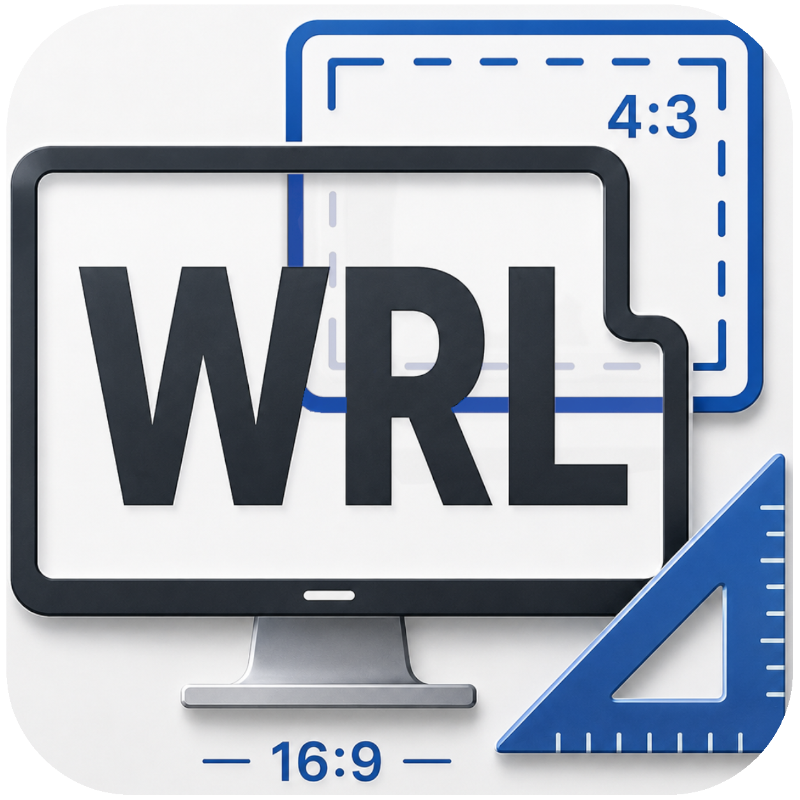
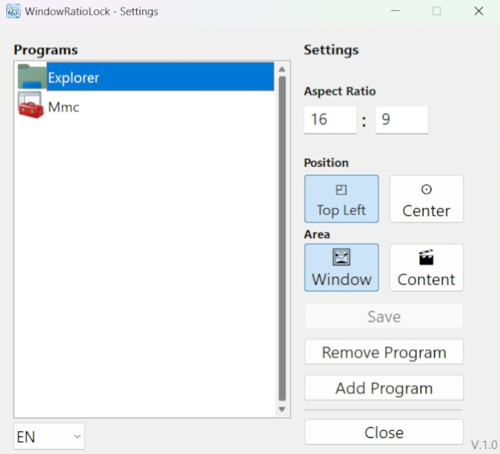
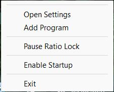

  

<h1 align="center">WindowRatioLock</h1>

  <strong>
    WindowRatioLock automatically maintains user-defined window aspect ratios
    while resizing application windows on Windows 10/11.
  </strong>

## Features:
- Maintain user-defined window aspect ratios while resizing
- Per-application configuration
- Two resize modes:
  - **Window Mode** – maintains the aspect ratio of the entire window
  - **Content Mode** – maintains the aspect ratio of the application's content area
- Two anchor positions:
  - **Top-Left** – keeps the top-left corner fixed while resizing
  - **Center** – resizes symmetrically around the window center
- Multi-language interface
- System tray integration
- Optional automatic startup with Windows
- Lightweight

## Screenshots:

  
  
  

## Download:

The latest precompiled executable is available from the **Releases** page.

If you want to inspect, modify, or contribute to the project, the complete source code is available in this repository.

> [!IMPORTANT]
> **Project Status: Work in Progress**
>
> WindowRatioLock is still a work in progress. Although it is stable and works well for my own use cases, the codebase is currently not as clean or well-structured as I would like, and many comments are still written in German.
>
> The project was developed with the assistance of AI as my first larger programming project. There may still be bugs, edge cases, or compatibility issues with certain applications.
>
> Feedback, bug reports, suggestions, and pull requests are greatly appreciated.
>
> **Planned features**
>
> * Manual viewport offset adjustment for applications where **Content Mode** does not correctly detect the application's content area.
> * General code cleanup and refactoring.

## Installation:

1. Download the latest **WindowRatioLock** ZIP archive from the **Releases** section.
2. Extract the ZIP archive and move the extracted folder to a permanent location (for example, `C:\Program Files\WindowRatioLock` or any folder of your choice).
3. Double-click **WindowRatioLock.exe** to start the application.

## First Start:

After launching, WindowRatioLock will appear in the Windows system tray.

* **Double-click** the tray icon to open the **Settings** window.
* **Right-click** the tray icon to open the context menu and optionally enable **Start with Windows**.
* Add the applications you want to manage and configure the desired aspect ratio and resize mode for each one.

> [!TIP]
> Keep the entire WindowRatioLock folder together. Do not move or delete individual files, as the application requires the included resources to function correctly.

